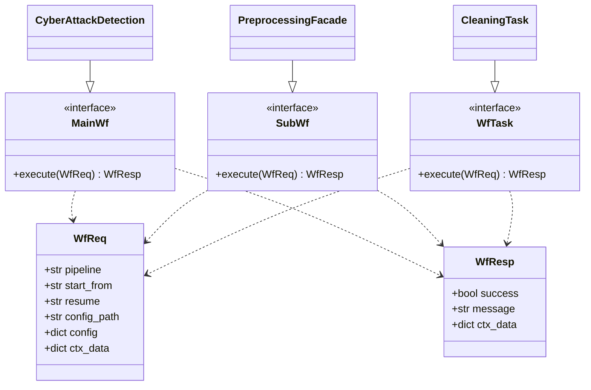
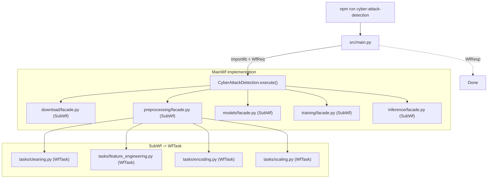
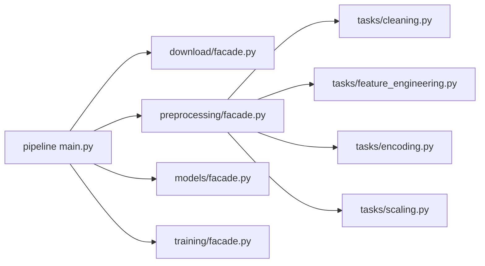

# Professional PyTorch Project Structure

## Directory Layout

```
Threat-Detection-Model-DeepLearning/
│
├── package.json                  # Task runner (npm scripts as CLI shortcuts)
├── pyproject.toml                # Python deps managed via uv
├── README.md
│
├── src/
│   ├── main.py                   # Facade — ~10 lines, zero pipeline imports
│   │
│   ├── core/                     # Shared framework (like Django internals)
│   │   ├── common/
│   │   │   └── wfs/
│   │   │       ├── interfaces.py # MainWf, SubWf, WfTask ABCs
│   │   │       └── dtos.py       # WfReq, WfResp dataclasses
│   │   ├── config.py             # Config loading workflow (YAML -> validated dict)
│   │   ├── loader.py             # Dynamic pipeline discovery via importlib
│   │   ├── logger.py             # Structured logging setup
│   │   └── seed.py               # Reproducibility
│   │
│   └── pipelines/                # Each pipeline is a Django-like "app"
│       └── cyber_attack_detection/
│           ├── main.py           # CyberAttackDetection(MainWf) — pipeline orchestrator
│           │
│           ├── download/         # Sub-workflow 1: data acquisition
│           │   ├── facade.py     # Sub-workflow facade — loads tasks dynamically
│           │   └── tasks/
│           │       └── ...       # Independent task files
│           │
│           ├── preprocessing/    # Sub-workflow 2: data preprocessing
│           │   ├── facade.py     # Sub-workflow facade
│           │   └── tasks/
│           │       ├── cleaning.py
│           │       ├── feature_engineering.py
│           │       ├── encoding.py
│           │       └── scaling.py
│           │
│           ├── models/           # Sub-workflow 3: model setup
│           │   ├── facade.py     # Sub-workflow facade
│           │   └── tasks/
│           │       ├── baseline.py
│           │       └── components.py
│           │
│           ├── training/         # Sub-workflow 4: train / validate / test
│           │   ├── facade.py     # Sub-workflow facade
│           │   └── tasks/
│           │       ├── trainer.py
│           │       ├── losses.py
│           │       └── metrics.py
│           │
│           └── inference/        # Prediction / serving
│               ├── facade.py     # Sub-workflow facade
│               └── tasks/
│                   └── predict.py
│
├── configs/
│   └── cyber_attack_detection/
│       ├── default.yaml
│       └── experiment/
│           └── baseline.yaml
│
├── scripts/
├── notebooks/
├── tests/
│
├── data/                         # gitignored — per-pipeline subdirectories
│   ├── raw/
│   ├── processed/
│   └── splits/
│
├── outputs/                      # gitignored — per-pipeline subdirectories
│   ├── checkpoints/
│   ├── logs/
│   └── predictions/
│
└── .gitignore
```

---

## Architecture: Interface & DTO Pattern

Every component implements one of three Abstract Base Classes from `core/common/wfs/interfaces.py`, and all communication passes through two dataclass DTOs from `core/common/wfs/dtos.py`.

### Class hierarchy



### Execution flow



`WfReq` and `WfResp` are passed at every level. The `ctx_data` dict inside them carries intermediary state between sub-workflows and tasks.

### `core/common/wfs/dtos.py` — data transfer objects

```python
from dataclasses import dataclass, field

@dataclass
class WfReq:
    pipeline: str = ""
    start_from: str | None = None
    resume: str | None = None
    config_path: str | None = None
    config: dict = field(default_factory=dict)
    ctx_data: dict = field(default_factory=dict)

@dataclass
class WfResp:
    success: bool = True
    message: str = ""
    ctx_data: dict = field(default_factory=dict)
```

### `core/common/wfs/interfaces.py` — ABCs

```python
from abc import ABC, abstractmethod
from core.common.wfs.dtos import WfReq, WfResp

class MainWf(ABC):
    @abstractmethod
    def execute(self, req: WfReq) -> WfResp: ...

class SubWf(ABC):
    @abstractmethod
    def execute(self, req: WfReq) -> WfResp: ...

class WfTask(ABC):
    @abstractmethod
    def execute(self, req: WfReq) -> WfResp: ...
```

### `src/main.py` — top-level facade

Constructs a `WfReq`, dynamically loads the pipeline's `MainWf` implementation, and calls `execute()`. No pipeline-specific imports, no if/elif chains.

```python
from core.common.wfs.dtos import WfReq, WfResp

def main():
    args = parse_args()
    req = WfReq(
        pipeline=args.pipeline,
        start_from=args.start_from,
        resume=args.resume,
        config_path=args.config,
    )
    module = importlib.import_module(f"pipelines.{args.pipeline}.main")
    pipeline_cls = getattr(module, "Pipeline")
    resp: WfResp = pipeline_cls().execute(req)
```

### `pipelines/cyber_attack_detection/main.py` — implements MainWf

The `CyberAttackDetection` class orchestrates sub-workflows in order, threading `ctx_data` through each step. A `Pipeline` alias at module level is used by `src/main.py` for dynamic loading.

```python
from core.common.wfs.interfaces import MainWf
from core.common.wfs.dtos import WfReq, WfResp

class CyberAttackDetection(MainWf):
    def execute(self, req: WfReq) -> WfResp:
        steps = self._resolve_steps(req.start_from)
        for step_name in steps:
            module = importlib.import_module(
                f"pipelines.cyber_attack_detection.{step_name}.facade"
            )
            resp = getattr(module, "Facade")().execute(req)
            if not resp.success:
                return resp
            req.ctx_data.update(resp.ctx_data)
        return WfResp(success=True, message="Pipeline completed", ctx_data=req.ctx_data)

Pipeline = CyberAttackDetection
```

### Each `facade.py` — implements SubWf

```python
from core.common.wfs.interfaces import SubWf
from core.common.wfs.dtos import WfReq, WfResp

class PreprocessingFacade(SubWf):
    def execute(self, req: WfReq) -> WfResp:
        # dynamically load + cache tasks, run in order
        ...

Facade = PreprocessingFacade
```

### Each `tasks/*.py` — implements WfTask

```python
from core.common.wfs.interfaces import WfTask
from core.common.wfs.dtos import WfReq, WfResp

class CleaningTask(WfTask):
    def execute(self, req: WfReq) -> WfResp:
        # read req.ctx_data, do work, return WfResp with updated ctx_data
        ...
```

---

## Sub-Workflow Design: Facade + Tasks

There is no separate `sub_workflows/` package. Each sub-module (download, preprocessing, models, training, inference) **is** a sub-workflow, with two layers:



### `facade.py` — sub-workflow facade (implements SubWf)

Each sub-module has a `facade.py` that:

- Implements the `SubWf` ABC
- Dynamically loads `WfTask` classes from its `tasks/` folder via importlib
- Caches loaded task objects to avoid re-importing
- Runs tasks in the configured order, threading `WfReq`/`WfResp` through each

### `tasks/` — independent task files (implement WfTask)

Each file in `tasks/` is a standalone unit of work. Tasks:

- Implement the `WfTask` ABC
- Receive `WfReq`, do their job, return `WfResp` with updated `ctx_data`
- Have no knowledge of other tasks or the facade
- Can be tested independently

### The five sub-modules for cyber_attack_detection

| Sub-module | Facade loads | Purpose |
|---|---|---|
| `download/` | tasks for fetching data from Kaggle or other sources | Data acquisition |
| `preprocessing/` | cleaning, feature_engineering, encoding, scaling | Raw -> processed |
| `models/` | baseline model, components | Model instantiation + optimizer + scheduler |
| `training/` | trainer, losses, metrics | Train/validate per epoch + checkpoint + test |
| `inference/` | predict | Load best model, run on new data |

---

## Preprocessing Stages

| Stage | File | What it does |
|---|---|---|
| Cleaning | `cleaning.py` | Duplicates, missing values, outliers, dtype casting |
| Feature Engineering | `feature_engineering.py` | Derive features from raw network traffic fields |
| Encoding | `encoding.py` | Label-encode target, one-hot/ordinal for categoricals |
| Scaling | `scaling.py` | StandardScaler/MinMaxScaler, fit on train only |

Encoders and scalers are saved to `data/processed/<pipeline>/artifacts/` for inference reuse.

---

## Config-Driven Design

All hyperparameters live in YAML under `configs/<pipeline_name>/`.

### Example: `configs/cyber_attack_detection/default.yaml`

```yaml
pipeline:
  name: "cyber_attack_detection"
  description: "Detect cyber attacks in network traffic"

download:
  source: "kaggle"
  dataset: "cicids2017"
  destination: "data/raw/cyber_attack_detection"

preprocessing:
  cleaning:
    drop_duplicates: true
    missing_threshold: 0.5
    outlier_method: "iqr"
    outlier_factor: 1.5
  features:
    derive_ratios: true
    time_windows: [30, 60, 300]
  encoding:
    target_column: "label"
    categorical_columns: ["protocol_type", "service", "flag"]
    method: "onehot"
  scaling:
    method: "standard"
    columns: "numeric"

data:
  processed_dir: "data/processed/cyber_attack_detection"
  splits_dir: "data/splits/cyber_attack_detection"
  batch_size: 256
  num_workers: 4
  val_split: 0.2
  test_split: 0.1

model:
  name: "baseline"
  hidden_dims: [128, 64, 32]
  dropout: 0.3

training:
  epochs: 50
  lr: 0.001
  weight_decay: 1e-5
  early_stopping_patience: 5
  checkpoint_dir: "outputs/checkpoints/cyber_attack_detection"
  log_dir: "outputs/logs/cyber_attack_detection"

seed: 42
```

---

## Running the Project

### Full pipeline

```bash
npm run cyber-attack-detection
```

### Restart from a specific sub-workflow

```bash
npm run cyber-attack-detection:from -- preprocessing
npm run cyber-attack-detection:from -- model_setup
npm run cyber-attack-detection:from -- train_eval
```

### Resume interrupted training from checkpoint

```bash
npm run cyber-attack-detection:resume
```

Loads `outputs/checkpoints/cyber_attack_detection/last.pt` and picks up at the exact epoch where it stopped.

| Checkpoint file | Saved when | Purpose |
|---|---|---|
| `last.pt` | End of every epoch | Resume interrupted training |
| `best.pt` | Validation metric improves | Inference and evaluation |

### Adding a new pipeline

1. Create `src/pipelines/<name>/main.py` with a class implementing `MainWf` and a `Pipeline` alias
2. Create sub-folders with `facade.py` (implementing `SubWf`) and `tasks/` (implementing `WfTask`)
3. Create `configs/<name>/default.yaml`
4. Add to `package.json`:

```json
"<name>": "conda run ... python src/main.py <name>"
```

No changes to `src/main.py` or `core/` needed.

---

## Command Reference (package.json)

### Environment

| Command | What it does |
|---|---|
| `npm run setup-initial` | One-time: create conda env, install uv, install all deps |
| `npm run setup-venv-daily` | Daily: verify env, sync deps, set up shell alias |
| `npm run teardown` | Remove the conda environment |

After `setup-venv-daily`, activate with: `pytorch_project_tdm`

### Pipelines

| Command | What it does |
|---|---|
| `npm run cyber-attack-detection` | Full pipeline: download -> preprocess -> model_setup -> train_eval |
| `npm run cyber-attack-detection:from -- <step>` | Restart from a sub-workflow |
| `npm run cyber-attack-detection:resume` | Resume training from last checkpoint |

---

## Dependencies

### Runtime (`pyproject.toml`)

| Package | Purpose |
|---|---|
| `torch` | PyTorch core |
| `torchvision` | Vision utilities |
| `torchaudio` | Audio utilities |
| `pandas` | Data manipulation |
| `numpy` | Numerical operations |
| `scikit-learn` | Metrics, train/test split, scalers, encoders |
| `pyyaml` | Config loading |
| `kaggle` | Kaggle API client |
| `requests` | HTTP client |
| `tensorboard` | Training visualization |
| `tqdm` | Progress bars |

### Dev

| Package | Purpose |
|---|---|
| `pytest` | Testing |
| `ruff` | Linting and formatting |
