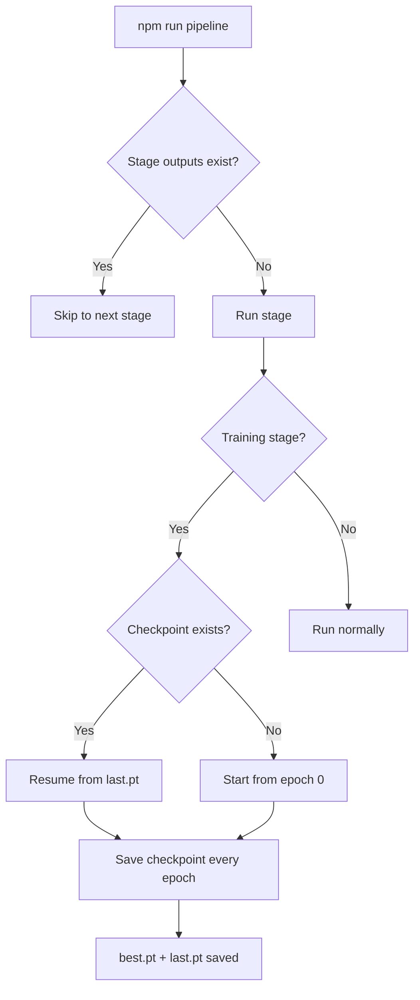

# Professional PyTorch Project Structure

## Directory Layout

```
Threat-Detection-Model-DeepLearning/
│
├── package.json                  # Task runner (npm scripts as CLI shortcuts)
├── pyproject.toml                # Python deps managed via uv
├── README.md
│
├── configs/                      # All hyperparams and settings — NOT in code
│   ├── default.yaml              # Base config (data paths, model, training, preprocessing)
│   └── experiment/
│       └── baseline.yaml         # Per-experiment overrides
│
├── src/
│   └── threat_detection/
│       ├── __init__.py
│       │
│       ├── data/                 # Data access layer
│       │   ├── __init__.py
│       │   ├── download.py       # Kaggle API download + raw data caching
│       │   ├── dataset.py        # torch.utils.data.Dataset subclass(es)
│       │   └── datamodule.py     # Builds DataLoaders, handles train/val/test splits
│       │
│       ├── preprocessing/        # Full preprocessing pipeline (stage by stage)
│       │   ├── __init__.py
│       │   ├── cleaning.py       # Missing values, duplicates, outliers, type casting
│       │   ├── feature_engineering.py  # Derive features from raw network traffic fields
│       │   ├── encoding.py       # Label encoding, one-hot for categorical columns
│       │   ├── scaling.py        # StandardScaler / MinMaxScaler on numeric features
│       │   └── run_preprocessing.py    # Orchestrates all stages: raw -> processed
│       │
│       ├── models/               # Model definitions only — no training logic
│       │   ├── __init__.py
│       │   ├── baseline.py       # First model (MLP or 1D-CNN)
│       │   └── components.py     # Reusable blocks (attention, residual, etc.)
│       │
│       ├── training/             # Training and evaluation loops
│       │   ├── __init__.py
│       │   ├── trainer.py        # Train/val loop, checkpointing, early stopping
│       │   ├── losses.py         # Custom loss functions (focal loss, weighted CE, etc.)
│       │   └── metrics.py        # Precision, recall, F1, AUC, confusion matrix
│       │
│       ├── inference/            # Prediction / serving
│       │   ├── __init__.py
│       │   └── predict.py        # Load checkpoint, run inference on new data
│       │
│       ├── pipeline/             # End-to-end workflow orchestration
│       │   ├── __init__.py
│       │   └── workflow.py       # Chains: download -> preprocess -> split -> train -> evaluate
│       │
│       └── utils/
│           ├── __init__.py
│           ├── logger.py         # Structured logging
│           ├── seed.py           # Reproducibility
│           └── config.py         # YAML config loader + validation
│
├── scripts/                      # Thin CLI entry points
│   ├── run_pipeline.py           # Run the full workflow end-to-end
│   ├── download_data.py          # Just download
│   ├── preprocess.py             # Just preprocess
│   ├── train.py                  # Just train
│   ├── evaluate.py               # Just evaluate
│   └── predict.py                # One-off inference
│
├── notebooks/
│   └── 01_eda.ipynb
│
├── tests/
│   ├── test_preprocessing.py
│   ├── test_dataset.py
│   ├── test_model.py
│   └── test_training.py
│
├── data/                         # gitignored
│   ├── raw/                      # Untouched downloads
│   ├── processed/                # After preprocessing pipeline
│   └── splits/                   # train.pt / val.pt / test.pt
│
├── outputs/                      # gitignored
│   ├── checkpoints/
│   ├── logs/
│   └── predictions/
│
└── .gitignore
```

---

## Pipeline / Workflow Concept

This is the core of how professional projects differ from academic ones. Instead of running disconnected scripts, a single `pipeline/workflow.py` orchestrates every step:


Each step:

- Reads from a known location (`data/raw/`, `data/processed/`, etc.)
- Writes to the next stage's input location
- Is independently runnable (`python scripts/preprocess.py`) OR chained via the workflow
- Logs what it did and can be skipped if output already exists (idempotent)

### `pipeline/workflow.py` — the orchestrator

```python
class Pipeline:
    def __init__(self, config):
        self.config = config
        self.steps = [
            ("download",    self._download),
            ("preprocess",  self._preprocess),
            ("split",       self._split),
            ("train",       self._train),
            ("evaluate",    self._evaluate),
        ]

    def run(self, start_from="download", stop_after="evaluate"):
        """Run pipeline steps between start_from and stop_after inclusive."""
        ...

    def _preprocess(self):
        """Chains cleaning -> feature_eng -> encoding -> scaling."""
        ...
```

Run the full pipeline: `npm run pipeline`
Restart from a specific stage: `python scripts/run_pipeline.py --start-from train`

---

## Preprocessing Module (Detailed)

### `cleaning.py`

- Drop duplicates, handle missing values (impute or drop based on config thresholds)
- Remove constant/near-constant columns
- Cast dtypes (string timestamps to datetime, object cols to numeric where possible)
- Flag and handle outliers (IQR or z-score, configurable)

### `feature_engineering.py`

- Derive new features from raw network traffic fields (e.g., bytes-per-packet, flow duration ratios, flag counts)
- Time-windowed aggregations if applicable
- Domain-specific features for threat detection

### `encoding.py`

- Label-encode the target column (attack type -> integer)
- One-hot or ordinal encoding for categorical features (protocol_type, service, flag)
- Store encoder objects to `data/processed/encoders/` for inference reuse

### `scaling.py`

- Fit StandardScaler or MinMaxScaler on training data only (prevents data leakage)
- Transform val/test using the fitted scaler
- Save scaler to `data/processed/scalers/` for inference reuse

### `run_preprocessing.py` — chains them together

```python
def run_preprocessing(config):
    df = load_raw_data(config)
    df = clean(df, config.preprocessing.cleaning)
    df = engineer_features(df, config.preprocessing.features)
    df = encode(df, config.preprocessing.encoding)
    df = scale(df, config.preprocessing.scaling)
    save_processed(df, config.data.processed_dir)
```

---

## Config-Driven Design

All hyperparameters live in YAML files under `configs/`. Code reads config — never hardcodes values like `lr=0.001`. This makes experiments reproducible and diffable in git.

### Example: `configs/default.yaml`

```yaml
seed: 42

data:
  dataset: "CICIDS2017"
  raw_dir: "data/raw"
  processed_dir: "data/processed"
  splits_dir: "data/splits"
  batch_size: 256
  num_workers: 4
  val_split: 0.2
  test_split: 0.1

preprocessing:
  cleaning:
    drop_duplicates: true
    missing_threshold: 0.5       # drop columns with >50% missing
    outlier_method: "iqr"        # "iqr", "zscore", or "none"
    outlier_factor: 1.5
  features:
    derive_ratios: true
    time_windows: [30, 60, 300]  # seconds
  encoding:
    target_column: "label"
    categorical_columns: ["protocol_type", "service", "flag"]
    method: "onehot"             # "onehot" or "ordinal"
  scaling:
    method: "standard"           # "standard" or "minmax"
    columns: "numeric"           # "numeric" = all numeric cols, or explicit list

model:
  name: "baseline"
  hidden_dims: [128, 64, 32]
  dropout: 0.3

training:
  epochs: 50
  lr: 0.001
  weight_decay: 1e-5
  early_stopping_patience: 5
  checkpoint_dir: "outputs/checkpoints"
```

Per-experiment overrides in `configs/experiment/baseline.yaml` only need to specify what differs from `default.yaml`.

---

## Key Professional Patterns

### 1. Data Module Pattern

A `DataModule` class owns the full data pipeline — load processed data, split, and build DataLoaders. Training code never touches files directly.

### 2. Trainer Owns the Loop

A `Trainer` class handles: train loop, validation loop, checkpointing, early stopping, metric logging, and device management. Models stay pure `nn.Module` — no training logic inside them.

### 3. Reproducibility Baked In

`seed.py` sets `torch.manual_seed`, `numpy.random.seed`, `random.seed`, and `torch.backends.cudnn.deterministic`. Called once at startup from config.

### 4. Scripts Are Thin

`scripts/train.py` is ~20 lines: parse args, load config, instantiate data/model/trainer, call `trainer.fit()`. All real logic lives in `src/`.

### 5. Preprocessing Artifacts Are Saved

Encoders and scalers are persisted to disk so that inference uses the exact same transformations as training. No fit-transform at inference time.

---

## Running the Project

### Full pipeline (first time or clean run)

```bash
npm run pipeline
```

Runs every stage end-to-end: download -> preprocess -> split -> train -> evaluate.

### Restart from a specific stage

If training fails or you only changed the model, skip the earlier stages:

```bash
npm run pipeline:from -- train
```

Each stage checks if its output already exists (`data/processed/`, `data/splits/`, etc.) and skips completed work automatically.

### Resume interrupted training (checkpoint)

If training was interrupted mid-epoch (crash, Ctrl+C, machine restart), the `Trainer` saves a checkpoint at the end of every epoch. Resume from exactly where you stopped:

```bash
npm run train:resume
```

This loads `outputs/checkpoints/last.pt` which contains:

- Model weights (`model.state_dict()`)
- Optimizer state (learning rates, momentum buffers)
- Current epoch number
- Best validation metric so far
- Scheduler state

So if training dies at epoch 35 of 50, it picks up at epoch 35 — not epoch 0.

The trainer always saves two checkpoint files:

| File | When saved | Purpose |
|---|---|---|
| `outputs/checkpoints/last.pt` | End of every epoch | Resume interrupted training |
| `outputs/checkpoints/best.pt` | When validation metric improves | Use for inference and evaluation |

### How it all fits together



---

## Command Reference (package.json)

### Environment

| Command | What it does |
|---|---|
| `npm run setup-initial` | One-time: create conda env, install uv, install all deps |
| `npm run setup-venv-daily` | Daily: verify env, sync deps, set up shell alias |
| `npm run teardown` | Remove the conda environment |

After running `setup-venv-daily` once, activate the env with: `pytorch_project_tdm`

### Pipeline and Stages

| Command | What it does |
|---|---|
| `npm run pipeline` | Full end-to-end: download -> preprocess -> split -> train -> evaluate |
| `npm run pipeline:from -- <stage>` | Restart from a specific stage (download, preprocess, split, train, evaluate) |
| `npm run download-data` | Fetch dataset from Kaggle |
| `npm run preprocess` | Run only the preprocessing pipeline |
| `npm run train` | Run training from scratch |
| `npm run train:resume` | Resume training from last checkpoint |
| `npm run evaluate` | Run evaluation using best checkpoint |
| `npm run predict` | Run inference on new data |

---

## Dependencies

### Runtime (`pyproject.toml`)

| Package | Purpose |
|---|---|
| `torch` | PyTorch core |
| `torchvision` | Vision utilities |
| `torchaudio` | Audio utilities |
| `pandas` | Data manipulation |
| `numpy` | Numerical operations |
| `scikit-learn` | Metrics, train/test split, scalers, encoders |
| `pyyaml` | Config loading |
| `kaggle` | Kaggle API client |
| `requests` | HTTP client |
| `tensorboard` | Training visualization |
| `tqdm` | Progress bars |

### Dev

| Package | Purpose |
|---|---|
| `pytest` | Testing |
| `ruff` | Linting and formatting |
