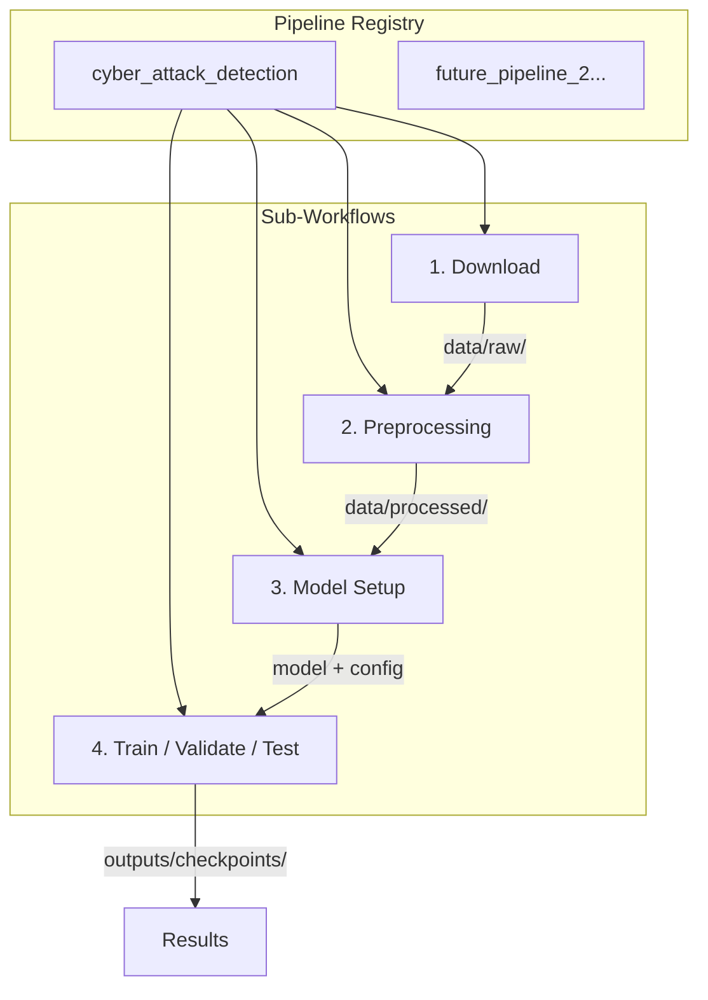
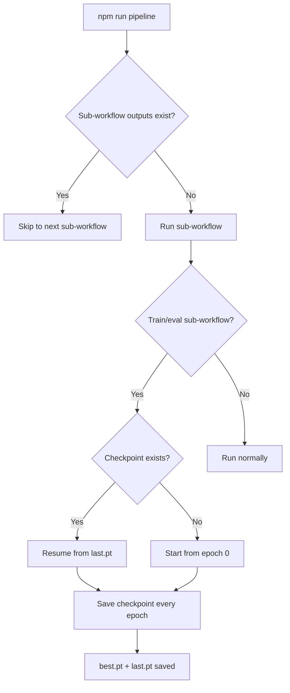

# Professional PyTorch Project Structure

## Directory Layout

```
Threat-Detection-Model-DeepLearning/
│
├── package.json                  # Task runner (npm scripts as CLI shortcuts)
├── pyproject.toml                # Python deps managed via uv
├── README.md
│
├── configs/
│   └── cyber_attack_detection/   # Per-pipeline config (one folder per pipeline)
│       ├── default.yaml
│       └── experiment/
│           └── baseline.yaml
│
├── src/
│   └── threat_detection/
│       │
│       ├── sub_workflows/        # Reusable sub-workflow base + implementations
│       │   ├── base.py           # BaseSubWorkflow ABC
│       │   ├── download.py       # Sub-workflow: fetch data from source
│       │   ├── preprocessing.py  # Sub-workflow: clean -> features -> encode -> scale
│       │   ├── model_setup.py    # Sub-workflow: instantiate model, optimizer, scheduler
│       │   └── train_eval.py     # Sub-workflow: train + validate per epoch, then test
│       │
│       ├── preprocessing/        # Preprocessing stage implementations
│       │   ├── cleaning.py
│       │   ├── feature_engineering.py
│       │   ├── encoding.py
│       │   └── scaling.py
│       │
│       ├── models/               # Model definitions only — no training logic
│       │   ├── baseline.py
│       │   └── components.py
│       │
│       ├── training/             # Training and evaluation loops
│       │   ├── trainer.py        # Epoch loop with interleaved train/val + checkpoint
│       │   ├── losses.py
│       │   └── metrics.py
│       │
│       ├── inference/
│       │   └── predict.py
│       │
│       ├── pipelines/            # Each pipeline composes sub-workflows
│       │   ├── registry.py       # Register and discover pipelines by name
│       │   └── cyber_attack_detection.py
│       │
│       └── utils/
│           ├── logger.py
│           ├── seed.py
│           └── config.py
│
├── scripts/
│   ├── run_pipeline.py           # python scripts/run_pipeline.py --pipeline cyber_attack_detection
│   └── run_sub_workflow.py       # python scripts/run_sub_workflow.py --pipeline cyber_attack_detection --step preprocessing
│
├── notebooks/
├── tests/
│
├── data/                         # gitignored — per-pipeline subdirectories
│   ├── raw/
│   ├── processed/
│   └── splits/
│
├── outputs/                      # gitignored — per-pipeline subdirectories
│   ├── checkpoints/
│   ├── logs/
│   └── predictions/
│
└── .gitignore
```

---

## Multi-Pipeline Architecture

The project is a **registry of pipelines**, each composed of **sub-workflows**. The first pipeline is `cyber_attack_detection`. Future pipelines plug into the same structure.



### Per-pipeline isolation

Each pipeline gets its own subdirectories so they never collide:

```
data/raw/cyber_attack_detection/
data/processed/cyber_attack_detection/
outputs/checkpoints/cyber_attack_detection/
outputs/logs/cyber_attack_detection/
```

### Adding a future pipeline

1. Create `configs/<new_pipeline_name>/default.yaml`
2. Create `pipelines/<new_pipeline_name>.py` composing its sub-workflows
3. Reuse existing sub-workflows or create new ones in `sub_workflows/`
4. Run: `npm run pipeline -- --pipeline <new_pipeline_name>`

---

## Sub-Workflow Design

Each sub-workflow inherits from `BaseSubWorkflow` with three methods:

| Method | Purpose |
|---|---|
| `validate_inputs()` | Raise if required inputs are missing from config or context |
| `should_skip()` | Return True if outputs already exist (idempotent) |
| `run()` | Execute the sub-workflow, return updated context dict |

A shared `context` dict flows between sub-workflows. Each reads what it needs and adds its outputs.

### The four sub-workflows for cyber_attack_detection

**1. Download** — fetch dataset from Kaggle (configurable source/dataset in YAML). Adds `context["raw_data_path"]`.

**2. Preprocessing** — chains cleaning -> feature engineering -> encoding -> scaling using the `preprocessing/` stage modules. Saves encoders/scalers as artifacts for inference reuse.

**3. Model Setup** — instantiate model, optimizer, scheduler from config. If resuming from a checkpoint, restores all states and the epoch counter.

**4. Train / Validate / Test** — one sub-workflow because training and validation are interleaved per epoch:
  - Each epoch: train -> validate -> checkpoint -> early stop check
  - After all epochs: test with best model

---

## Preprocessing Stages

| Stage | File | What it does |
|---|---|---|
| Cleaning | `cleaning.py` | Duplicates, missing values, outliers, dtype casting |
| Feature Engineering | `feature_engineering.py` | Derive features from raw network traffic fields |
| Encoding | `encoding.py` | Label-encode target, one-hot/ordinal for categoricals |
| Scaling | `scaling.py` | StandardScaler/MinMaxScaler, fit on train only |

Encoders and scalers are saved to `data/processed/<pipeline>/artifacts/` so inference uses the exact same transformations.

---

## Config-Driven Design

All hyperparameters live in YAML under `configs/<pipeline_name>/`. Code never hardcodes values.

### Example: `configs/cyber_attack_detection/default.yaml`

```yaml
pipeline:
  name: "cyber_attack_detection"
  description: "Detect cyber attacks in network traffic"

download:
  source: "kaggle"
  dataset: "cicids2017"
  destination: "data/raw/cyber_attack_detection"

preprocessing:
  cleaning:
    drop_duplicates: true
    missing_threshold: 0.5
    outlier_method: "iqr"
    outlier_factor: 1.5
  features:
    derive_ratios: true
    time_windows: [30, 60, 300]
  encoding:
    target_column: "label"
    categorical_columns: ["protocol_type", "service", "flag"]
    method: "onehot"
  scaling:
    method: "standard"
    columns: "numeric"

data:
  processed_dir: "data/processed/cyber_attack_detection"
  splits_dir: "data/splits/cyber_attack_detection"
  batch_size: 256
  num_workers: 4
  val_split: 0.2
  test_split: 0.1

model:
  name: "baseline"
  hidden_dims: [128, 64, 32]
  dropout: 0.3

training:
  epochs: 50
  lr: 0.001
  weight_decay: 1e-5
  early_stopping_patience: 5
  checkpoint_dir: "outputs/checkpoints/cyber_attack_detection"
  log_dir: "outputs/logs/cyber_attack_detection"

seed: 42
```

---

## Running the Project

### Full pipeline

```bash
npm run pipeline
```

Runs all four sub-workflows: download -> preprocessing -> model_setup -> train_eval.

### Restart from a specific sub-workflow

```bash
npm run pipeline:from -- preprocessing
npm run pipeline:from -- model_setup
npm run pipeline:from -- train_eval
```

Skips earlier sub-workflows. Each sub-workflow also checks if its output already exists.

### Run a single sub-workflow

```bash
npm run sub-workflow -- download
npm run sub-workflow -- preprocessing
```

### Resume interrupted training (checkpoint)

```bash
npm run train:resume
```

Loads `outputs/checkpoints/cyber_attack_detection/last.pt` containing model weights, optimizer state, epoch number, and best metric. Picks up exactly where it stopped.

| Checkpoint file | Saved when | Purpose |
|---|---|---|
| `last.pt` | End of every epoch | Resume interrupted training |
| `best.pt` | Validation metric improves | Inference and evaluation |

### How it fits together



---

## Command Reference (package.json)

### Environment

| Command | What it does |
|---|---|
| `npm run setup-initial` | One-time: create conda env, install uv, install all deps |
| `npm run setup-venv-daily` | Daily: verify env, sync deps, set up shell alias |
| `npm run teardown` | Remove the conda environment |

After `setup-venv-daily`, activate with: `pytorch_project_tdm`

### Pipeline

| Command | What it does |
|---|---|
| `npm run pipeline` | Full end-to-end (default: cyber_attack_detection) |
| `npm run pipeline:from -- <step>` | Restart from a sub-workflow (download, preprocessing, model_setup, train_eval) |
| `npm run sub-workflow -- <step>` | Run a single sub-workflow |
| `npm run train:resume` | Resume training from last checkpoint |

---

## Dependencies

### Runtime (`pyproject.toml`)

| Package | Purpose |
|---|---|
| `torch` | PyTorch core |
| `torchvision` | Vision utilities |
| `torchaudio` | Audio utilities |
| `pandas` | Data manipulation |
| `numpy` | Numerical operations |
| `scikit-learn` | Metrics, train/test split, scalers, encoders |
| `pyyaml` | Config loading |
| `kaggle` | Kaggle API client |
| `requests` | HTTP client |
| `tensorboard` | Training visualization |
| `tqdm` | Progress bars |

### Dev

| Package | Purpose |
|---|---|
| `pytest` | Testing |
| `ruff` | Linting and formatting |
