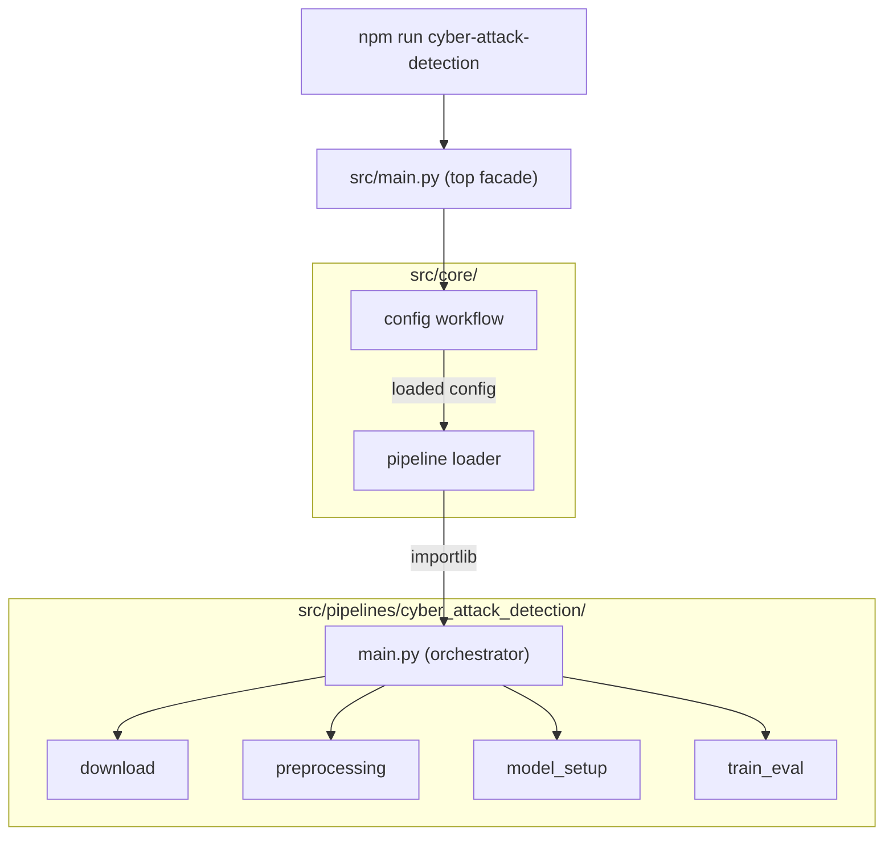

# Professional PyTorch Project Structure

## Directory Layout

```
Threat-Detection-Model-DeepLearning/
│
├── package.json                  # Task runner (npm scripts as CLI shortcuts)
├── pyproject.toml                # Python deps managed via uv
├── README.md
│
├── src/
│   ├── main.py                   # Facade — ~10 lines, zero pipeline imports
│   │
│   ├── core/                     # Shared framework (like Django internals)
│   │   ├── base.py               # BaseSubWorkflow ABC
│   │   ├── config.py             # Config loading workflow (YAML -> validated dict)
│   │   ├── loader.py             # Dynamic pipeline discovery via importlib
│   │   ├── registry.py           # Pipeline registry (auto-populated by apps)
│   │   ├── runner.py             # PipelineRunner — executes sub-workflows in order
│   │   ├── logger.py             # Structured logging setup
│   │   └── seed.py               # Reproducibility
│   │
│   └── pipelines/                # Each pipeline is a Django-like "app"
│       └── cyber_attack_detection/
│           ├── app.py            # AppConfig: name, description, sub_workflow list
│           ├── main.py           # Pipeline orchestrator — called by src/main.py
│           ├── sub_workflows/
│           │   ├── download.py
│           │   ├── preprocessing.py
│           │   ├── model_setup.py
│           │   └── train_eval.py
│           ├── preprocessing/
│           │   ├── cleaning.py
│           │   ├── feature_engineering.py
│           │   ├── encoding.py
│           │   └── scaling.py
│           ├── models/
│           │   ├── baseline.py
│           │   └── components.py
│           ├── training/
│           │   ├── trainer.py
│           │   ├── losses.py
│           │   └── metrics.py
│           └── inference/
│               └── predict.py
│
├── configs/
│   └── cyber_attack_detection/
│       ├── default.yaml
│       └── experiment/
│           └── baseline.yaml
│
├── scripts/
├── notebooks/
├── tests/
│
├── data/                         # gitignored — per-pipeline subdirectories
│   ├── raw/
│   ├── processed/
│   └── splits/
│
├── outputs/                      # gitignored — per-pipeline subdirectories
│   ├── checkpoints/
│   ├── logs/
│   └── predictions/
│
└── .gitignore
```

---

## Architecture: Django-Like App Pattern

Each pipeline is a self-contained "app" (like a Django app). Two-level facade: `src/main.py` handles common setup, then delegates to the pipeline's own `main.py` which orchestrates its sub-workflows.



### `src/main.py` — top-level facade

The entire file is ~10 lines. Handles only common concerns (parse args, load config, discover pipeline), then hands off to the pipeline's own orchestrator. No pipeline-specific imports. No if/elif chains.

```python
import sys
from core.config import load_config
from core.loader import discover_and_run_pipeline

def main():
    pipeline_name, args = parse_args(sys.argv)
    config = load_config(pipeline_name, args)
    discover_and_run_pipeline(pipeline_name, config, args)

if __name__ == "__main__":
    main()
```

### `pipelines/cyber_attack_detection/main.py` — pipeline orchestrator

Called by `src/main.py` via `core/loader.py`. Handles pipeline-specific setup: reads `app.py` config, resolves sub-workflow classes, runs them in order, manages the shared context dict. This is the pipeline's brain.

```python
def run(config, args):
    """Called by core/loader.py. Orchestrates this pipeline's sub-workflows."""
    from .app import pipeline_config
    # resolve dotted-string sub-workflows, build context, run in order
    ...
```

### `core/loader.py` — dynamic pipeline discovery

Uses `importlib` to find and load pipelines at runtime. No manual registration — just drop a folder in `pipelines/` with a `main.py` and `app.py`.

```python
import importlib

def discover_and_run_pipeline(name, config, args):
    module = importlib.import_module(f"pipelines.{name}.main")
    module.run(config, args)
```

### `core/config.py` — config loading as a workflow

Config loading is its own step so `main.py` stays clean:

1. Find config file: `configs/{pipeline_name}/default.yaml`
2. Load and parse YAML
3. Apply experiment overrides if `--experiment baseline` passed
4. Apply CLI overrides (e.g., `--training.lr 0.01`)
5. Validate required keys
6. Set up logging + seed from config
7. Return the final config dict

### Each pipeline's `app.py` — like Django's AppConfig

```python
pipeline_config = {
    "name": "cyber_attack_detection",
    "description": "Detect cyber attacks in network traffic using PyTorch",
    "sub_workflows": [
        "pipelines.cyber_attack_detection.sub_workflows.download.DownloadWorkflow",
        "pipelines.cyber_attack_detection.sub_workflows.preprocessing.PreprocessingWorkflow",
        "pipelines.cyber_attack_detection.sub_workflows.model_setup.ModelSetupWorkflow",
        "pipelines.cyber_attack_detection.sub_workflows.train_eval.TrainEvalWorkflow",
    ],
}
```

Sub-workflows are **dotted strings** resolved by the pipeline's `main.py` via importlib at runtime. Zero imports in `app.py`.

---

## Sub-Workflow Design

Each sub-workflow inherits from `core/base.py` with three methods:

| Method | Purpose |
|---|---|
| `validate_inputs()` | Raise if required inputs are missing from config or context |
| `should_skip()` | Return True if outputs already exist (idempotent) |
| `run()` | Execute the sub-workflow, return updated context dict |

A shared `context` dict flows between sub-workflows. Each reads what it needs and adds its outputs.

### The four sub-workflows for cyber_attack_detection

**1. Download** — fetch dataset from configured source (Kaggle). Adds `context["raw_data_path"]`.

**2. Preprocessing** — chains cleaning -> feature engineering -> encoding -> scaling. Saves encoders/scalers as artifacts.

**3. Model Setup** — instantiate model, optimizer, scheduler from config. Restores from checkpoint if resuming.

**4. Train / Validate / Test** — interleaved per epoch: train -> validate -> checkpoint -> early stop. Final test with best model.

---

## Preprocessing Stages

| Stage | File | What it does |
|---|---|---|
| Cleaning | `cleaning.py` | Duplicates, missing values, outliers, dtype casting |
| Feature Engineering | `feature_engineering.py` | Derive features from raw network traffic fields |
| Encoding | `encoding.py` | Label-encode target, one-hot/ordinal for categoricals |
| Scaling | `scaling.py` | StandardScaler/MinMaxScaler, fit on train only |

Encoders and scalers are saved to `data/processed/<pipeline>/artifacts/` for inference reuse.

---

## Config-Driven Design

All hyperparameters live in YAML under `configs/<pipeline_name>/`.

### Example: `configs/cyber_attack_detection/default.yaml`

```yaml
pipeline:
  name: "cyber_attack_detection"
  description: "Detect cyber attacks in network traffic"

download:
  source: "kaggle"
  dataset: "cicids2017"
  destination: "data/raw/cyber_attack_detection"

preprocessing:
  cleaning:
    drop_duplicates: true
    missing_threshold: 0.5
    outlier_method: "iqr"
    outlier_factor: 1.5
  features:
    derive_ratios: true
    time_windows: [30, 60, 300]
  encoding:
    target_column: "label"
    categorical_columns: ["protocol_type", "service", "flag"]
    method: "onehot"
  scaling:
    method: "standard"
    columns: "numeric"

data:
  processed_dir: "data/processed/cyber_attack_detection"
  splits_dir: "data/splits/cyber_attack_detection"
  batch_size: 256
  num_workers: 4
  val_split: 0.2
  test_split: 0.1

model:
  name: "baseline"
  hidden_dims: [128, 64, 32]
  dropout: 0.3

training:
  epochs: 50
  lr: 0.001
  weight_decay: 1e-5
  early_stopping_patience: 5
  checkpoint_dir: "outputs/checkpoints/cyber_attack_detection"
  log_dir: "outputs/logs/cyber_attack_detection"

seed: 42
```

---

## Running the Project

### Full pipeline

```bash
npm run cyber-attack-detection
```

### Restart from a specific sub-workflow

```bash
npm run cyber-attack-detection:from -- preprocessing
npm run cyber-attack-detection:from -- model_setup
npm run cyber-attack-detection:from -- train_eval
```

### Resume interrupted training from checkpoint

```bash
npm run cyber-attack-detection:resume
```

Loads `outputs/checkpoints/cyber_attack_detection/last.pt` and picks up at the exact epoch where it stopped.

| Checkpoint file | Saved when | Purpose |
|---|---|---|
| `last.pt` | End of every epoch | Resume interrupted training |
| `best.pt` | Validation metric improves | Inference and evaluation |

### Adding a new pipeline

1. Create `src/pipelines/<name>/app.py` with a `pipeline_config` dict
2. Create sub-folders: `sub_workflows/`, `preprocessing/`, `models/`, `training/`, `inference/`
3. Create `configs/<name>/default.yaml`
4. Add to `package.json`:

```json
"<name>": "conda run ... python src/main.py <name>"
```

No changes to `main.py` or `core/` needed.

---

## Command Reference (package.json)

### Environment

| Command | What it does |
|---|---|
| `npm run setup-initial` | One-time: create conda env, install uv, install all deps |
| `npm run setup-venv-daily` | Daily: verify env, sync deps, set up shell alias |
| `npm run teardown` | Remove the conda environment |

After `setup-venv-daily`, activate with: `pytorch_project_tdm`

### Pipelines

| Command | What it does |
|---|---|
| `npm run cyber-attack-detection` | Full pipeline: download -> preprocess -> model_setup -> train_eval |
| `npm run cyber-attack-detection:from -- <step>` | Restart from a sub-workflow |
| `npm run cyber-attack-detection:resume` | Resume training from last checkpoint |

---

## Dependencies

### Runtime (`pyproject.toml`)

| Package | Purpose |
|---|---|
| `torch` | PyTorch core |
| `torchvision` | Vision utilities |
| `torchaudio` | Audio utilities |
| `pandas` | Data manipulation |
| `numpy` | Numerical operations |
| `scikit-learn` | Metrics, train/test split, scalers, encoders |
| `pyyaml` | Config loading |
| `kaggle` | Kaggle API client |
| `requests` | HTTP client |
| `tensorboard` | Training visualization |
| `tqdm` | Progress bars |

### Dev

| Package | Purpose |
|---|---|
| `pytest` | Testing |
| `ruff` | Linting and formatting |
